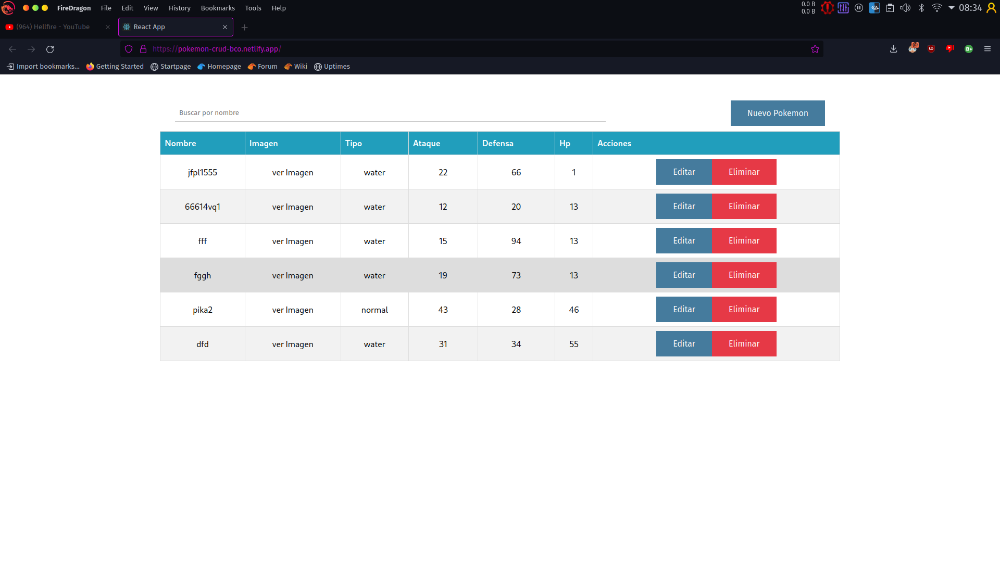

# Getting Started with Create React App

Este proyecto permite realizar operaciones CRUD usando una rest API de pokemones. la estructura del proyecto es el siguiente: 
- components: contiene todos los componentes para armar la app.
- contexts: uso de context API para compartir valores/funciones entre componentes primos. 
- interfaces: definiciones sobre objetos y comportamientos. 
- services: singleton para obtener la data de la API. 

## dependencias: 
- node v16.
- react: 18.1.0.
- axios: 0.27.0.
- typescript: 4.7.2

## Pasos a seguir para ejecutar de manera local el proyecto:
1. clonar el proyecto con git.
2. ejecutar: `npm install` para instalar las dependencias. 
3. ejecutar: `mpm start` para ejecutar le servidor de desarrollo local. 
4. para ejecutar las pruebas: `npm test`

## Capturas
